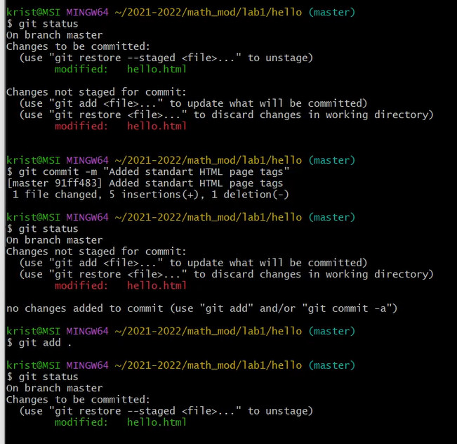
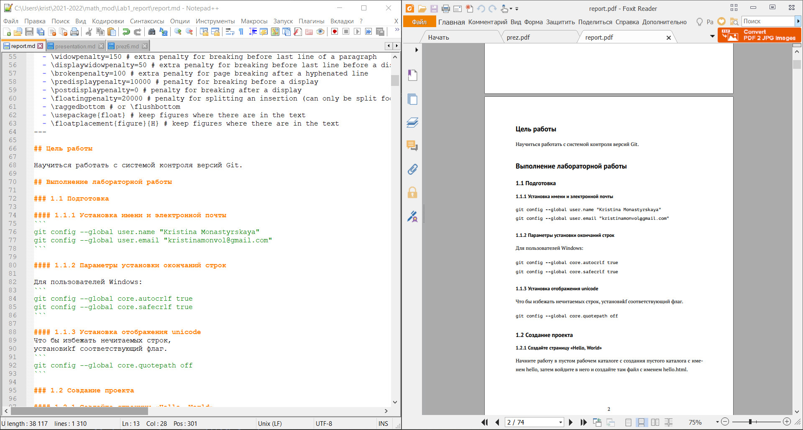

---
## Front matter
lang: ru-RU
title: Лабораторная работа №1
author: Монастырская Кристина Владимировна

## Formatting
toc: false
slide_level: 2
theme: metropolis
header-includes: 
 - \metroset{progressbar=frametitle,sectionpage=progressbar,numbering=fraction}
 - '\makeatletter'
 - '\beamer@ignorenonframefalse'
 - '\makeatother'
aspectratio: 43
section-titles: true
---

# Цели

- Изучить систему контроля версий git

- Познакомиться с markdown и научиться работать с ним

# Ход работы

## Изучение работы с системой контроля версий git

- Управление репозиторием

- Добавление и работа с объектами, тегами, ветками

- Клонирование, изменение, слияние и извлечение репозиториев

# Изучение работы с системой контроля версий git 
{width=80%}

# Ход работы

## Изучение работы с Markdown

- Изучение синтаксиса языка разметки

- Работа с pandoc

- Преобразование файлов .md в .pdf и .docx

# Изучение работы с Markdown

{width=80%}

# Вывод

В ходе данной лабораторной я научилась работать с системой git, изучила язык разметки markdown и научилась преобразовывать такие файлы в другие форматы.
