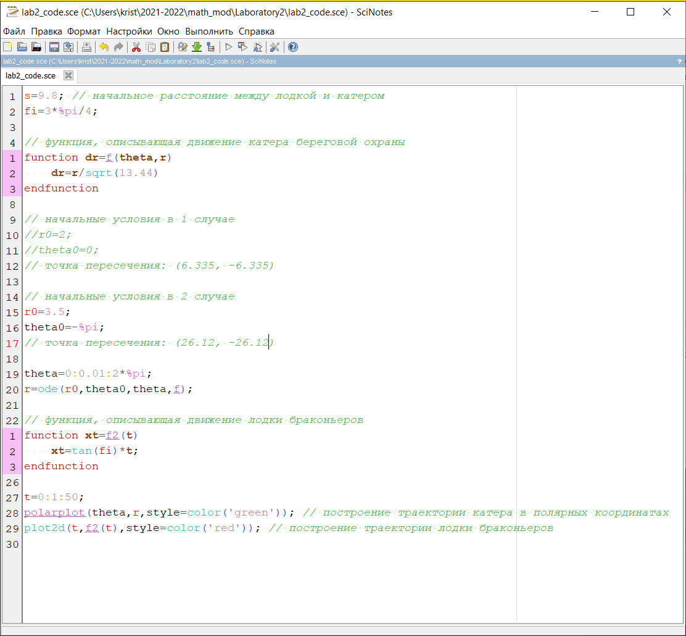
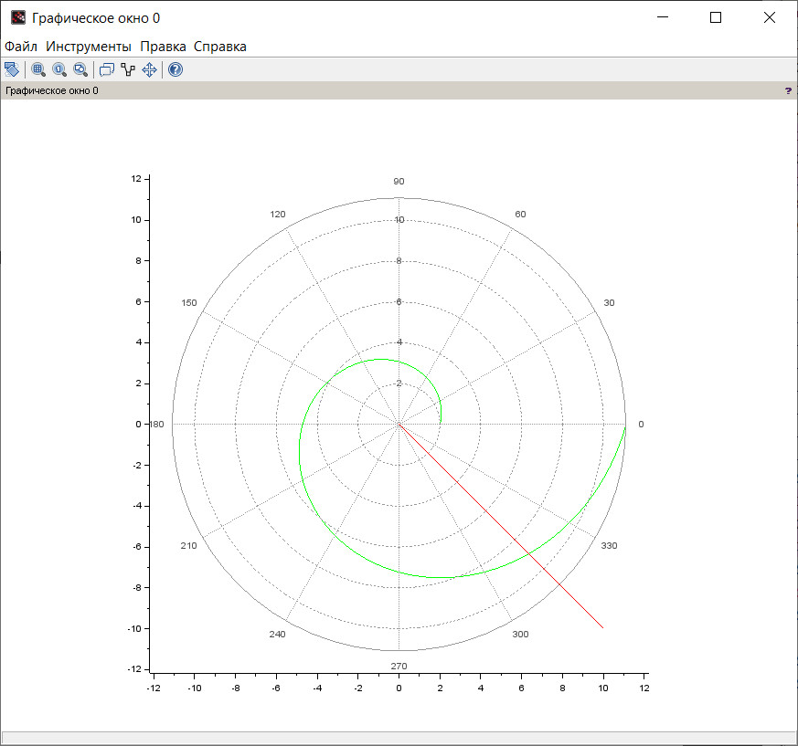
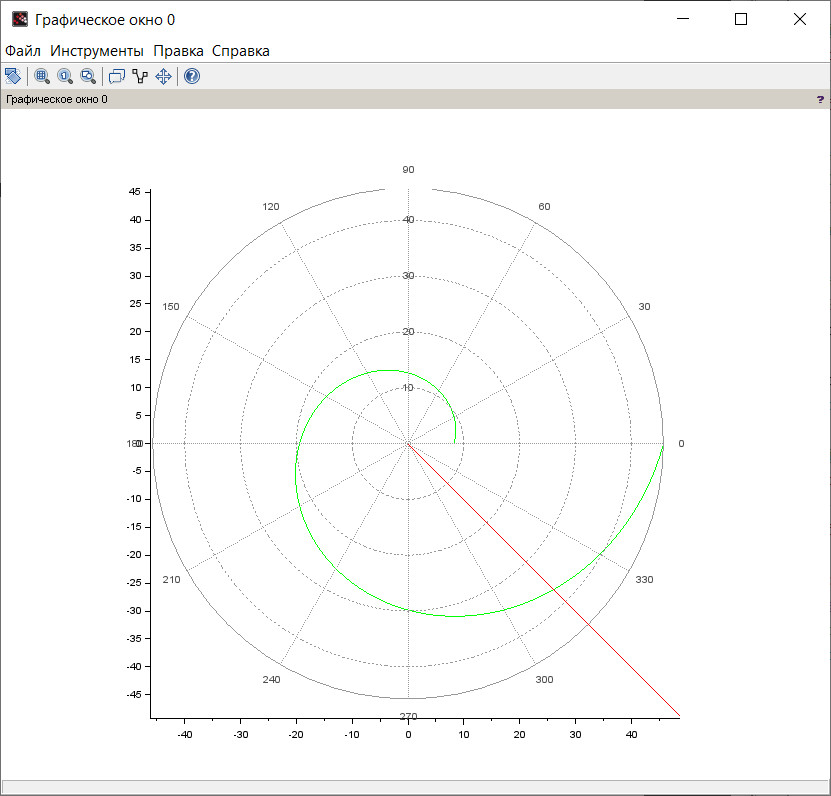
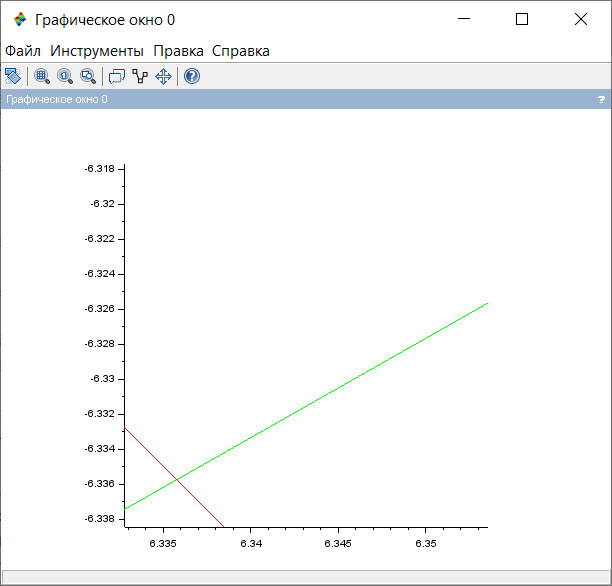
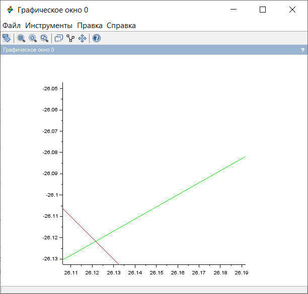

---
## Front matter
lang: ru-RU
title: Лабораторная работа №2
subtitle: Задача о погоне
author: Монастырская Кристина Владимировна

## Formatting
toc: false
slide_level: 2
theme: metropolis
header-includes: 
 - \metroset{progressbar=frametitle,sectionpage=progressbar,numbering=fraction}
 - '\makeatletter'
 - '\beamer@ignorenonframefalse'
 - '\makeatother'
aspectratio: 43
section-titles: true
---

# Цели

Научиться строить математическую модель для решения задачи о погоне

# Ход работы

- Вычисление значений с учетом начальных значений

- Написание программного кода в SciLab

- Создание и изучение графиков для рассмотрения траекторий движения объектов из задачи

# Написание программного кода в SciLab

{#fig:003 width=80%}

# Создание и изучение графиков

{#fig:001 width=40%}
{#fig:002 width=40%}

{#fig:004 width=40%}
{#fig:005 width=40%}

# Вывод

Научиться строить математическую модель для решения задачи о погоне