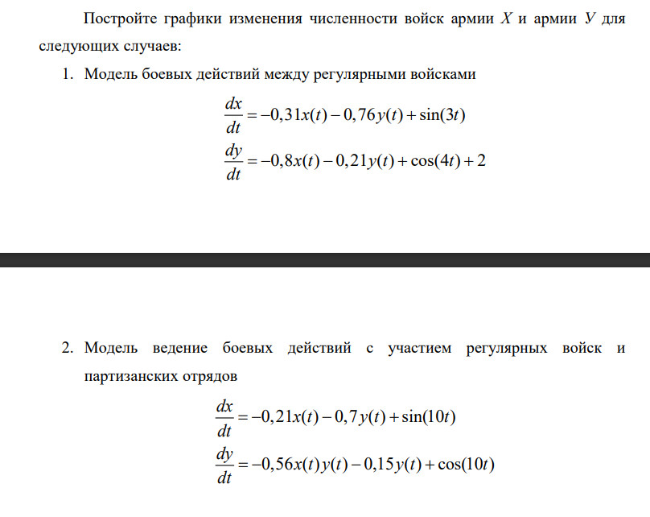

---
## Front matter
lang: ru-RU
title: Лабораторная работа №3
subtitle: Модель боевых действий
author: Монастырская Кристина Владимировна

## Formatting
toc: false
slide_level: 2
theme: metropolis
header-includes: 
 - \metroset{progressbar=frametitle,sectionpage=progressbar,numbering=fraction}
 - '\makeatletter'
 - '\beamer@ignorenonframefalse'
 - '\makeatother'
aspectratio: 43
section-titles: true
---

# Цели

Научиться создавать модели Ланчестера - модели боевых действий

# Задачи
{#fig:006 width=80%}

# Ход работы

- Изучение теоретического материала

- Написание программного кода для построения модели в OpenModelica

- Проведение симуляции согласно модели и проанализировать полученные графики

# Изучение теоретического материала
{#fig:001 width=80%}

# Написание программного кода для построения модели в OpenModelica

{#fig:002 width=40%}
{#fig:003 width=40%}

# Симуляция и полученные графики

{#fig:004 width=40%}
{#fig:005 width=40%}

# Вывод

Я научилась строить математическую модель для симуляции боевых действий