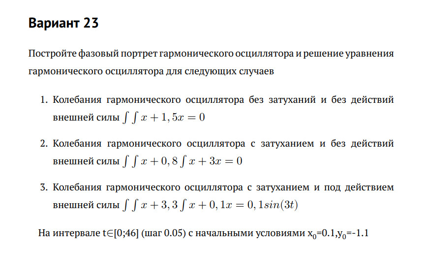
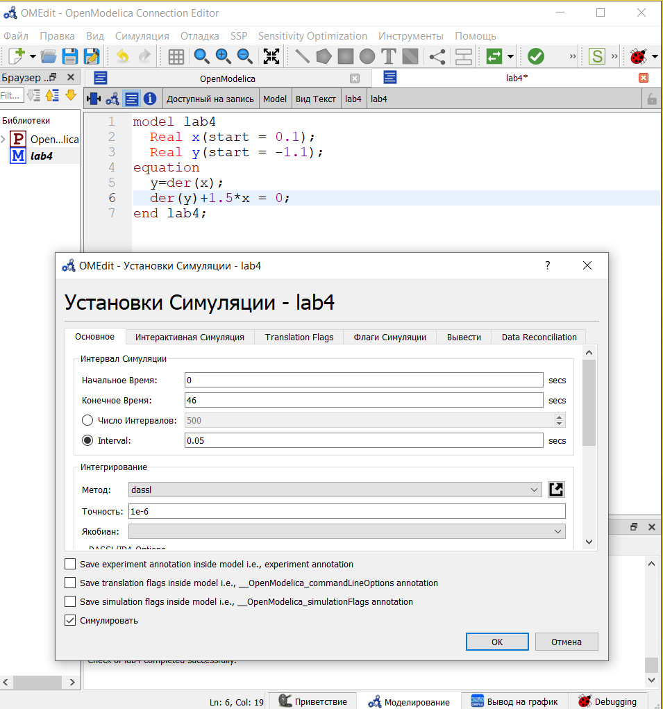
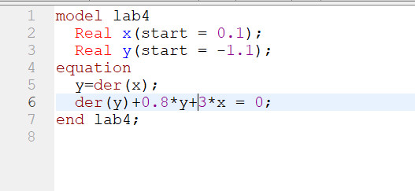
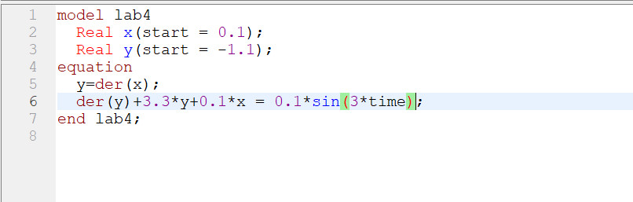
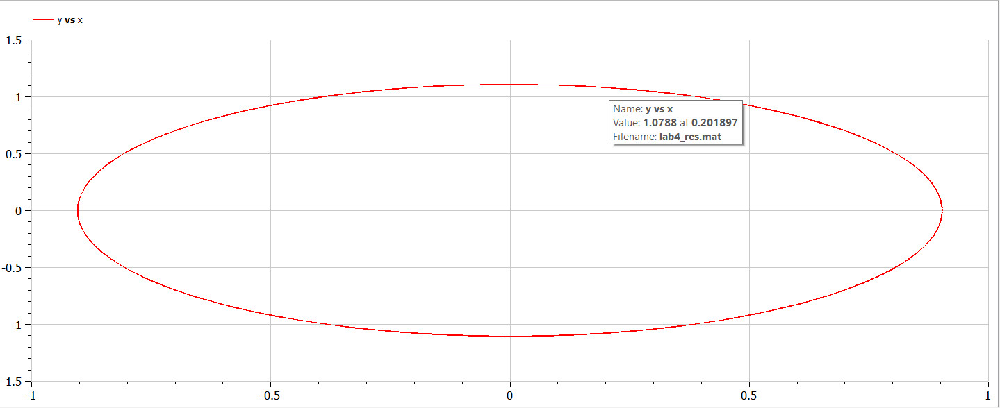
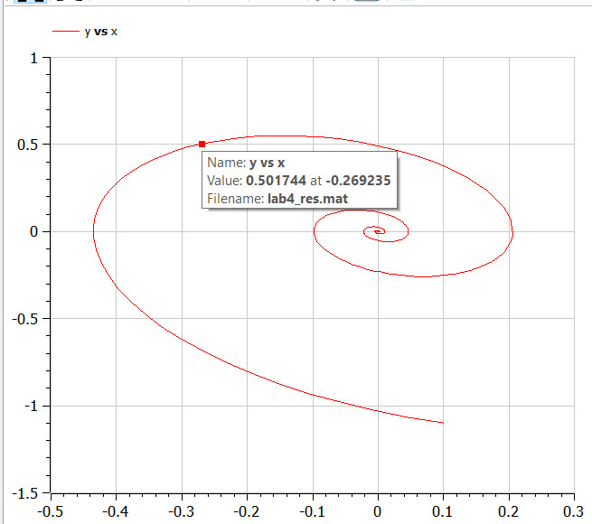
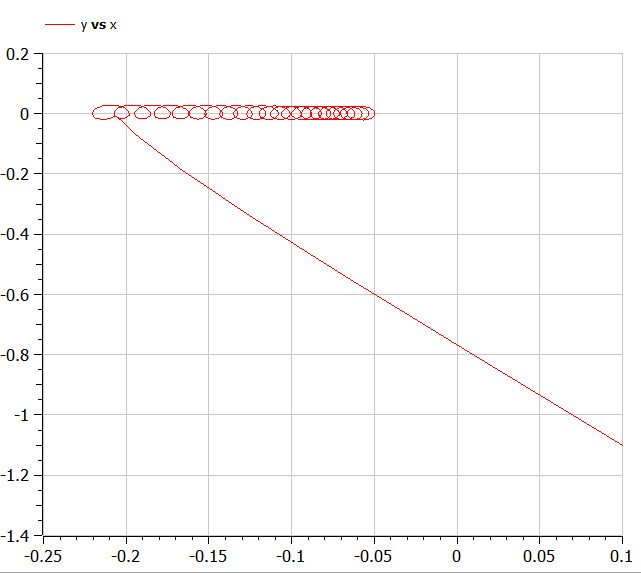

---
## Front matter
lang: ru-RU
title: Лабораторная работа №4
subtitle: Модель гармонических колебаний
author: Монастырская Кристина Владимировна

## Formatting
toc: false
slide_level: 2
theme: metropolis
header-includes: 
 - \metroset{progressbar=frametitle,sectionpage=progressbar,numbering=fraction}
 - '\makeatletter'
 - '\beamer@ignorenonframefalse'
 - '\makeatother'
aspectratio: 43
section-titles: true
---

# Цели

Научиться моделировать гармонические колебания

# Задачи
{#fig:001 width=100%}

# Ход работы

- Изучение теоретического материала

- Написание программного кода для построения модели в OpenModelica

- Проведение симуляции согласно модели и проанализировать полученные графики

# Написание программного кода для построения модели в OpenModelica

{#fig:002 width=30%}
{#fig:003 width=30%}
{#fig:003 width=30%}

# Симуляция и полученные графики

{#fig:004 width=30%}
{#fig:005 width=30%}
{#fig:006 width=30%}

# Вывод

Я научилась строить фазовый портрет и решать уравнения гармонического осциллятора.