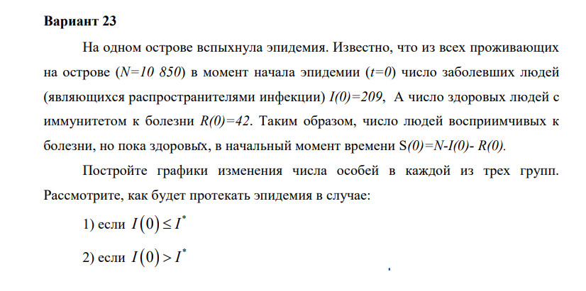
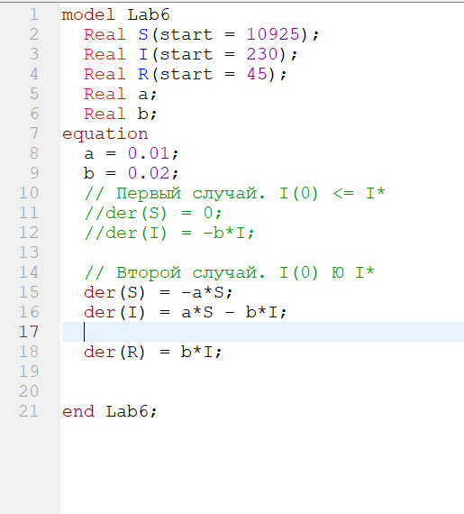
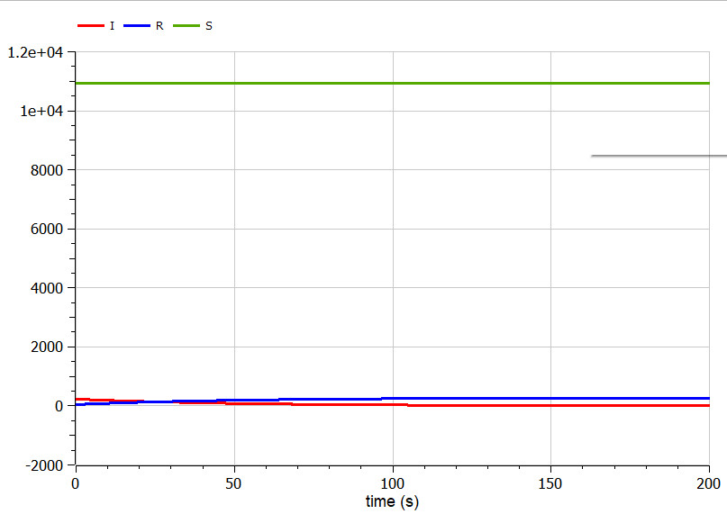
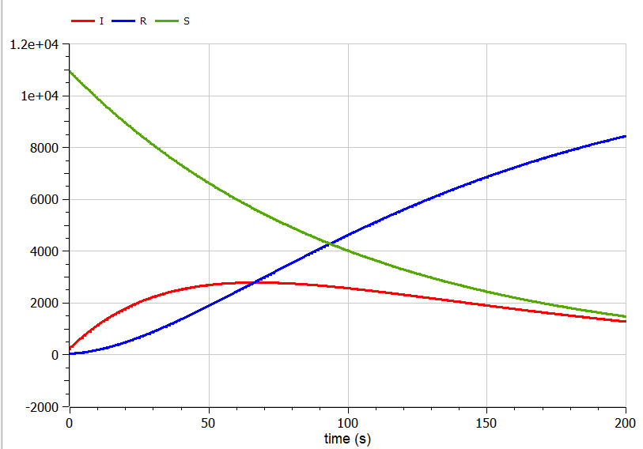

---
## Front matter
lang: ru-RU
title: Лабораторная работа №6
subtitle: Задача об эпидемии
author: Монастырская Кристина Владимировна

## Formatting
toc: false
slide_level: 2
theme: metropolis
header-includes: 
 - \metroset{progressbar=frametitle,sectionpage=progressbar,numbering=fraction}
 - '\makeatletter'
 - '\beamer@ignorenonframefalse'
 - '\makeatother'
aspectratio: 43
section-titles: true
---

# Цели

Изучить создание модели протекания эпидемии, используя средства OpenModelica

# Задачи

{#fig:001 width=100%}

# Ход работы

- Изучение теоретического материала

- Написание программного кода для создания модели в OpenModelica

- Проведение симуляции согласно модели и анализ полученных графиков течения эпидемии

# Написание программного кода для моделирования в OpenModelica

{#fig:002 width=70%}

# Симуляция и полученные графики

{#fig:003 width=45%}
{#fig:004 width=45%}

# Вывод

Я построила модель течения эпидемии для двух случаев.